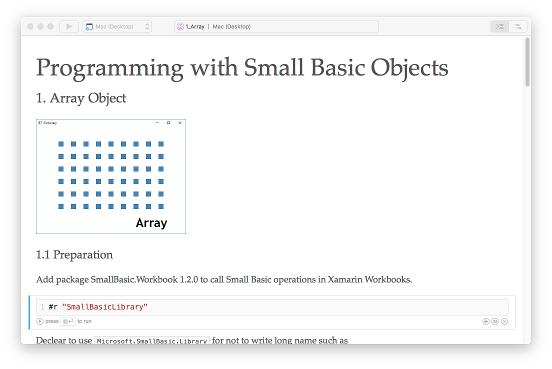

# Workbooks
## Programming with Small Basic Objects

This project contains Xamarin Workbooks to learn programming with Microsoft Small Basic objects.

## Usage
1. Install [Xamarin Workbooks](https://developer.xamarin.com/workbooks/). 
1. Download Workbooks.zip here. 
1. Unzip Workbooks.zip. 
1. Run Xamarin Workbooks. 
1. Open unzipped workbook folder. 

## Availability
|#|Object|Mac|Windows|
|---|---|---|---|
|1|Array|✓|✓|
|2|Clock|✓|✓|
|3|Controls| |✓|
|6|File|✓|✓|
|10|Math|✓|✓|
|14|Shapes| |✓|
|15|Sound| |✓|
|16|Stack|✓|✓|
|19|Timer| |✓|

## See Also
* [Xamarin Workbooks: Programing with Small Basic Objects](https://gallery.technet.microsoft.com/Xamarin-Workbooks-a4ee4e03) (TechNet Gallery)
